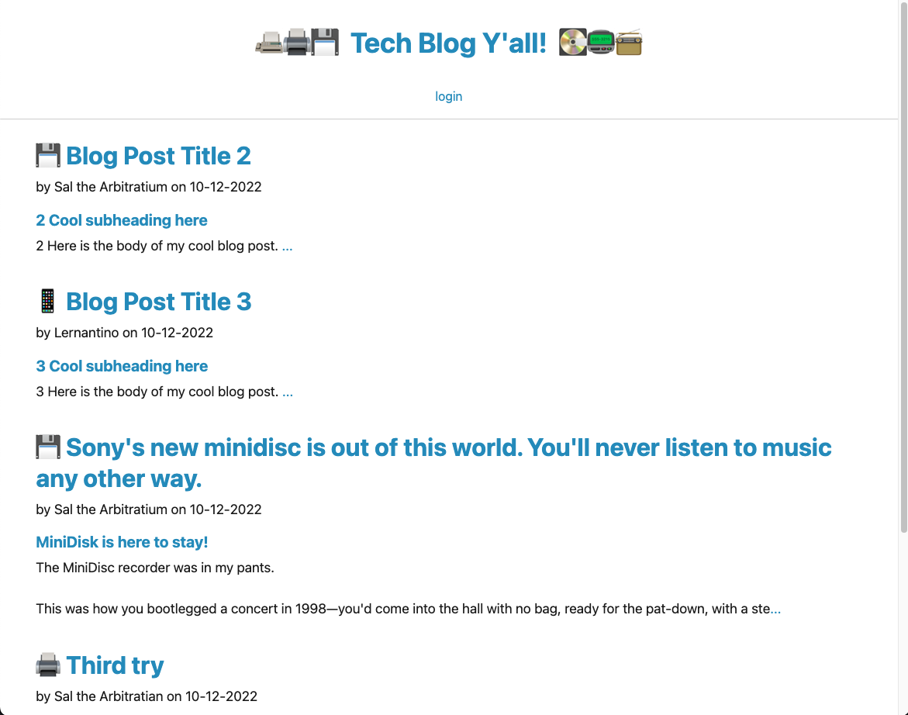

 
 

# Tech Blog using MVC Framework

## Description

A tech blog application using express and a littany of other technologies to have database backend supported API services that serve our webapp pages and functions.  Project is using the MVC frametwork using expressjs, sequelize,  express router (for  controllers) , mysql database and handlebars views. 

Users are able to signup for an account and start blogging.  Blog post owners can edit their posts and moderate their post comments from their profile dashboard.

## Table of Contents

- [Demo and Screen Shots](#demo)
- [Installation](#installation)
- [Usage](#usage)
- [Credits](#credits)
- [License](#license)
- [Questions](#questions)

## Demo
***

Demo:

[Demo Link](https://secure-retreat-20273.herokuapp.com/)

Screen Shot:

## Installation
***

clone repository, configure .env file for database access and database name, run 'npm run seed' to seed database, then run 

## Usage
***

Go to the hosted instance and create a user and begin posting blogs.  Create another user and post some blogs and comments.  Users can edit their own blog posts and moderate their own blog post comments.

## Credits
 ***

[conradjohnson](https://github.com/conradjohnson)

 ## License
 ***

  ISC License

  [https://opensource.org/licenses/ISC](https://opensource.org/licenses/ISC)
  
  Permission to use, copy, modify, and/or distribute this software for any
  purpose with or without fee is hereby granted, provided that the above
  copyright notice and this permission notice appear in all copies.
  
  THE SOFTWARE IS PROVIDED "AS IS" AND THE AUTHOR DISCLAIMS ALL WARRANTIES WITH
  REGARD TO THIS SOFTWARE INCLUDING ALL IMPLIED WARRANTIES OF MERCHANTABILITY
  AND FITNESS. IN NO EVENT SHALL THE AUTHOR BE LIABLE FOR ANY SPECIAL, DIRECT,
  INDIRECT, OR CONSEQUENTIAL DAMAGES OR ANY DAMAGES WHATSOEVER RESULTING FROM
  LOSS OF USE, DATA OR PROFITS, WHETHER IN AN ACTION OF CONTRACT, NEGLIGENCE OR
  OTHER TORTIOUS ACTION, ARISING OUT OF OR IN CONNECTION WITH THE USE OR
  PERFORMANCE OF THIS SOFTWARE.
  
  Copyright (c) 2022 James Johnson
          

# Questions
***
For questions or assistance, please contact through [GitHub Account](https://github.com/conradjohnson) or email: [notreallymyemail@gmail.com](mailto:notreallymyemail@gmail.com)

 [Back to top](#description)
